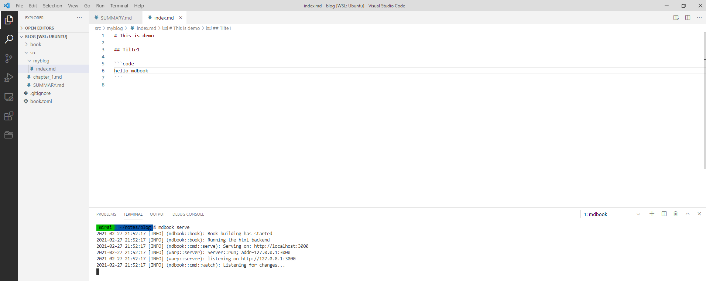
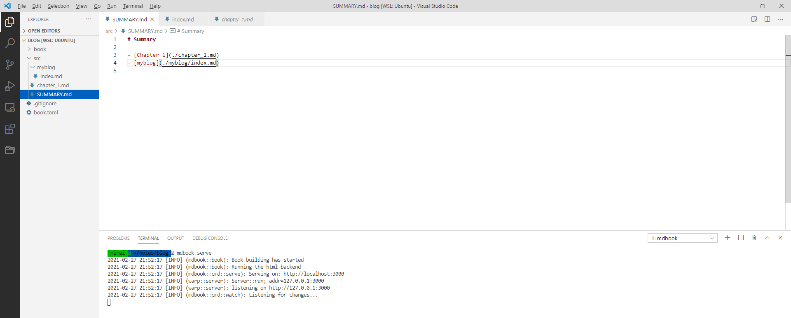
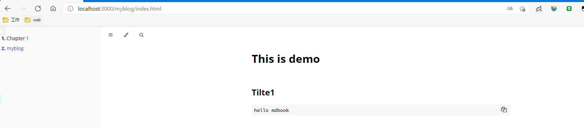

# 使用`mdBook`编写博客

## 阅读须知
阅读本文，你可以知道：
- 一些配置 mdBook 的安装搭建

但是，本文不涉及：
- [mdBook介绍](https://rust-lang.github.io/mdBook/index.html)
- [Rust安装](https://www.rust-lang.org/tools/install)
- [Cargo代理配置](https://blog.biofan.org/2019/02/cargo-config/)
- [markdown语法](https://www.runoob.com/markdown/md-tutorial.html)

## 安装 `mdbook`

```shell
cargo install mdbook
```

## 创建和初始blog

```shell
# 1.创建目录&&进入目录
mirai ~/notes  mkdir blog && cd "$_"
# 2.初始化项目
mirai ~/notes/blog  mdbook init
# 3.是否创建 .gitignore 忽略文件
Do you want a .gitignore to be created? (y/n)
y
# 4.创建标题
What title would you like to give the book?
Mirai's Tech blog
2021-02-27 21:22:41 [INFO] (mdbook::book::init): Creating a new book with stub content

All done, no errors...
# 5.查看文件目录
mirai ~/notes/blog  ls -al
total 24
drwxr-xr-x 4 mirai mirai 4096 Feb 27 21:22 .
drwxr-xr-x 3 mirai mirai 4096 Feb 27 21:22 ..
-rw-r--r-- 1 mirai mirai    5 Feb 27 21:22 .gitignore
drwxr-xr-x 2 mirai mirai 4096 Feb 27 21:22 book
-rw-r--r-- 1 mirai mirai   69 Feb 27 21:22 book.toml
drwxr-xr-x 2 mirai mirai 4096 Feb 27 21:22 src
mirai ~/notes/blog 

```

## 启动博客

```shell
mirai ~/notes/blog  mdbook serve
2021-02-27 21:34:40 [INFO] (mdbook::book): Book building has started
2021-02-27 21:34:40 [INFO] (mdbook::book): Running the html backend
2021-02-27 21:34:40 [INFO] (mdbook::cmd::serve): Serving on: http://localhost:3000
2021-02-27 21:34:40 [INFO] (warp::server): Server::run; addr=127.0.0.1:3000
2021-02-27 21:34:40 [INFO] (warp::server): listening on http://127.0.0.1:3000
2021-02-27 21:34:40 [INFO] (mdbook::cmd::watch): Listening for changes...

```
在浏览器输入 http://127.0.0.1:3000 便可以访问博客了

## 编辑博客

使用喜欢的编辑器打开 blog

- 创建文档 `myblog/index.md`
    

- 在 `SUMMARY.md` 添加链接
  

- 启动博客
  
  
## 发布博客到 Github Pages 

### Travis Ci

生成 Github TOKEN

添加 `.travis.yml` 文件

## 参考链接

- [https://github.com/huangjj27/huangjj27.github.io](https://github.com/huangjj27/huangjj27.github.io)